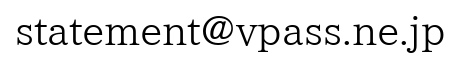
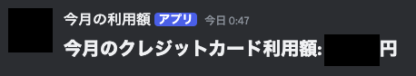

# SMBC_card_usage_notify
## このスクリプトについて
- 実行した当月分の、三井住友カードから送られる「ご利用のお知らせ」メールに記載されている利用額を合計して、Discordのチャンネルに投稿するGAS用スクリプトです。
- Vpassアプリ等では3日前までの合計しか表示されないので作成しました。
- 毎月1日は前月分の合計を取得します。
- Gmailを読み取るため、GAS向けのスクリプトです。

## 事前準備(必要なもの)
### GoogleアカウントおよびGmail
- 三井住友カードの「ご利用のお知らせ」メールを**Gmailで受信している**人向けのスクリプトです。
- 受信メールアドレス変更方法は[こちら](https://qa.smbc-card.com/mem/detail?site=4H4A00IO&category=55&id=95)をご参照ください。
### 三井住友カード
- 三井住友カード向けのスクリプトなので、ほかのカードで利用するためには改修が必要です。
### Discordアカウントおよびチャンネル投稿用Webhook URL
- 投稿先DiscordチャンネルのWebhook URLを取得してください。
- チャンネル設定 > 連携サービス > ウェブフックを作成 で発行・取得可能です

## 使い方
### Gmail自動ラベル付与設定
1. [Gmail](https://mail.google.com/)の検索バー右側アイコンから以下を設定して、 **「フィルタを作成」** を選択
- From
  - 
- 件名
  - `ご利用のお知らせ【三井住友カード】`
2. メールが検索条件と完全一致する場合：で以下のチェックボックスをオンにして **「フィルタを作成」** を選択する
- ラベルを付ける：
  - 新しいラベルを作成する(ラベル名は後ほど使用します)
- ○件の一致するスレッドにもフィルタを適用する

### GAS設定・実行
1. [Google App Script](https://script.google.com/home)から、「新しいプロジェクト」を選択して新規プロジェクトを作成する
2. [notify.gs](https://github.com/nrswnrsw/SMBC_card_usage_notify/blob/main/notify.gs)の内容を貼り付ける
3. 貼り付けたスクリプトの内容を修正する
- [2行目](https://github.com/nrswnrsw/SMBC_card_usage_notify/blob/main/notify.gs#L2)`credit_card_usage`を、Gmailで作成したラベル名に変更する
- [64行目](https://github.com/nrswnrsw/SMBC_card_usage_notify/blob/main/notify.gs#L64)`DISCORD_WEBHOOK_URL`を、取得したDiscordのWebhoook URLに変更する
4. 「実行」を選択し、スクリプトを実行する
- スクリプトに権限が要求されるので、許可してください
5. Discordにメッセージが投稿されることを確認する
- 

### 定期実行設定
#### 一日一回実行するための設定をします(以下は毎日0~1時実行時の設定)
1. Google App Script画面左側の「トリガー(時計アイコン)」を選択する
2. 「トリガーを追加」を選択する
3. 以下を設定し、「保存」を選択する
- 実行する関数を選択
  - `getCreditCardUsage`
- イベントのソースを選択
  - 時間主導型
- 時間ベースのトリガーのタイプを選択
  - 日付ベースのタイマー
- 時刻を選択
  - 午前0時~1時
4. 毎日0~1時に実行(Discordに投稿)されることを確認する

## 注意点
- メールのHTMLが変更になった場合、金額が正常に抽出されないのでスクリプトの修正が必要です。
